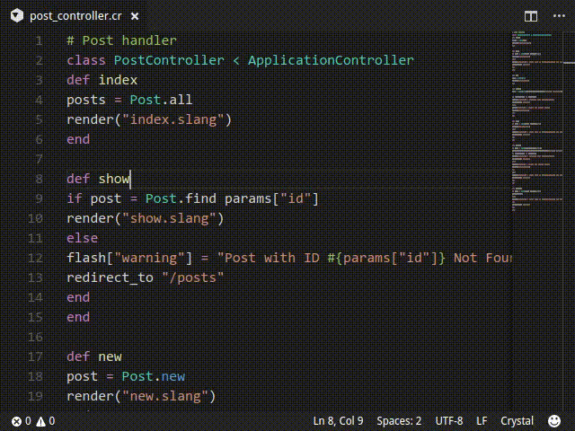

# VSCode Extension for Crystal Language


This extension provides support for the [Crystal](https://github.com/crystal-lang) programming language.



## Requirements

It is recommended to install the [Crystal programming language](https://crystal-lang.org/) (platform dependendant). No other dependencies are required.
For debugging support, it's recommended to follow the guide [here](https://dev.to/bcardiff/debug-crystal-in-vscode-via-codelldb-3lf).

## Features

- Syntax highlighting:
  - Syntax highlighting support for Crystal, [Slang](https://github.com/jeromegn/slang), and [ECR](https://crystal-lang.org/api/latest/ECR.html) (contributions for other Crystal templating languages welcome)
- Auto indentation:
  - Automatically indent while coding (after `do`, `if`, etc.)
- Snippets:
  - Helpful code completions for common use-cases
- Formatting
  - Allows for "format on save" and manual formatting, and works even if the editor isn't saved to disk
- Problems finder
  - When enabled, on opening or saving a file the project will be compiled to find any problems with the code, and these problems are reported in the editor. Depending on the project this can be slow and memory intensive, so there is an option to disable it.
- Document symbols
  - Allows for easier code navigation through breadcrumbs at the top of the file, as well as being able to view and jump to the documents symbols
- Peek / go to definition
  - When enabled, this allows for quickly jumping to the definition(s) for a method using the `crystal tool implementations` command
- Show type on hover
  - When enabled, this allows for viewing the type of a variable or return type of a method on hover, using the `crystal tool context` command
- Tasks
  - Enables executing various `crystal`/`shards` commands directly from VSCode

## Settings

- `compiler` - set a custom absolute path for the Crystal compiler
- `definitions` - enables jump-to-definition (reload required)
- `dependencies` - use the dependencies tool to determine the main for each file, required if there's multiple entrypoints to the project, can be slow
- `flags` - flags to pass to the compiler
- `hover` - show type information on hover (reload required)
- `main` - set a main executable to use for the current project (`${workspaceRoot}/src/main.cr`)
- `problems` - runs the compiler on save and reports any issues (reload required)
- `server` - absolute path to an LSP executable to use instead of the custom features provided by this extension, like [Crystalline](https://github.com/elbywan/crystalline) (reload required)
- `shards` - set a custom absolute path for the shards executable
- `spec-explorer` - enable the built-in testing UI for specs, recommended for Crystal >= 1.11 due to `--dry-run` flag (reload required)
- `spec-tags` - specific tags to pass to the spec runner

By default, the problems runner, hover provider, and definitions provider are turned on. This may not be ideal for larger projects due to compile times and memory usage, so it is recommended to turn them off in the vscode settings. That can be done per-project by creating a `.vscode/settings.json` file with:

```json
// .vscode/settings.json
{
  // Turn off slow/memory-intensive features for larger projects
  "crystal-lang.definitions": false,
  "crystal-lang.dependencies": false,
  "crystal-lang.hover": false,
  "crystal-lang.problems": false,
  "crystal-lang.spec-explorer": false,
}
```

## Supported Platforms

This extension has been tested on / should work on the following platforms:

- Linux (Arch / Ubuntu / Fedora)
- MacOS (Intel / Apple Silicon)
- Windows (10 Native / 10 WSL2 / 11)
- GitHub Codespaces

## Roadmap

These are some features that are planned or would be nice for the future of this project or others:

- Better / faster LSP support
- Better completion algorithm
- Better symbol detection
- Integrated debugger support
- Refactored task runner

## Release Notes

See [Changelog](https://github.com/crystal-lang-tools/vscode-crystal-lang/blob/master/CHANGELOG.md)

## Contributing

1. Fork it https://github.com/crystal-lang-tools/vscode-crystal-lang/fork
2. Create your feature branch `git checkout -b my-new-feature`
3. Commit your changes `git commit -am 'Add some feature'`
4. Push to the branch `git push origin my-new-feature`
5. Create a new Pull Request

## Contributors

- [@faustinoaq](https://github.com/faustinoaq) Faustino - creator
- [@nobodywasishere](https://github.com/nobodywasishere) Margret Riegert - maintainer

[See all contributors](https://github.com/crystal-lang-tools/vscode-crystal-lang/graphs/contributors)
